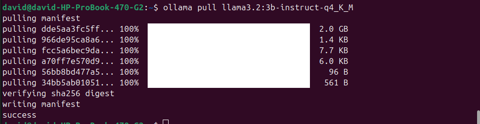

# **Task** 
Install the Ollama software, pull the Q4_K_M quantization of llama3.2:3b-instruct and ask it a question that could be answered by reading Writing R Extensions.

# **Answers**

## Installation of ollama
I firstly used the command curl to download ollama with my terminal

Here is the response after the installation is finished


## Pulling the model Q4_K_M quantization of llama3.2:3b-instruct
Here is the screenshot of the terminal after pulling the model


## Asking the model a question
Here is the prompt to the model

Based on the provided link, here's a summary of best practices for 
creating an R package:

1. **Use meaningful package names**: Choose a name that clearly indicates 
the purpose of your package.
2. **Keep documentation up-to-date**: Ensure your package's documentation 
is accurate and reflects any changes made to the code.
3. **Follow R coding standards**: Use standard R functions, packages, and 
naming conventions throughout your code.
4. **Use version control**: Utilize Git to track changes and collaborate 
with others on your package.
5. **Test thoroughly**: Include comprehensive testing in your package to 
ensure it works as expected.
6. **Provide example use cases**: Offer clear examples of how users can 
apply your package's functionality.

Here is the skeleton for an R package:

```r
# Project structure:
#
# - src/
#   - main.R: The main entry point of the package
#   - data/
#     - dataset1.csv: Example dataset for demonstration purposes
#     - dataset2.csv: Another example dataset
#   - functions/
#     - function1.R: First function to be exported
#     - function2.R: Second function to be exported
#     - functions.R: Package-level functions
#
# - inst/
#   - R:
#       - 00-loaders.R: Loaders for the package
#   - demos/
#       - demo.R: A sample script demonstrating how to use the package
#
# - man/
#    - index.Rd: Package documentation
#    - usage.Rd: Function usage instructions
#    - examples.Rd: Example scripts

# src/main.R:
# 1. Load necessary packages and libraries.
packageVersion("your_package_name")
library(tidyverse)
library(readr)

2. Initialize the package by setting up necessary files and directories.

3. Define functions to be exported from the package in functions.R:

```r
# functions.R:
function1 <- function() {
  # Function functionality here
}

function2 <- function() {
  # Function functionality here
}
```

4. Create example scripts demonstrating how users can apply the package's 
functionality in demos/demo.R:

```r
# demos/demo.R:
library(your_package_name)

your_function1()
your_function2()
```

5. Write documentation for your functions and package using man/index.Rd, 
usage/usage.Rd, and examples/examples.Rd.

6. Set up R loaders (00-loaders.R) to make the package easily accessible 
in R.

```r
# 00-loaders.R:
# 1. Load necessary packages and libraries.
# 2. Define an export function for your package's functions.
export(function1, function2)
```

This is a basic structure to get you started with creating an R package.


