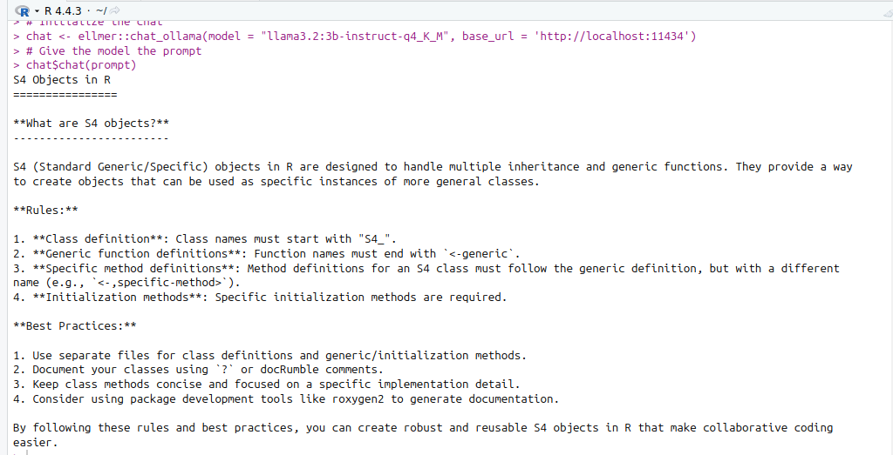

# Task 
Use the ellmer package to perform the easy task above but programmatically.

# Solution
I've decided to use ellmer to ask information about s4 objects

```R
# Defining the prompt
prompt <- "Assume you're a well known expert in using R for programming and you also know the R core is working. Please, give me a short course of 100 words about s4 objects ? What should I know ? What are the rules? What are the best practices?"
# Initialize the chat
chat <- ellmer::chat_ollama(model = "llama3.2:3b-instruct-q4_K_M", base_url = 'http://localhost:11434')
# Give the model the prompt
chat$chat(prompt)
```

Here is the model response


